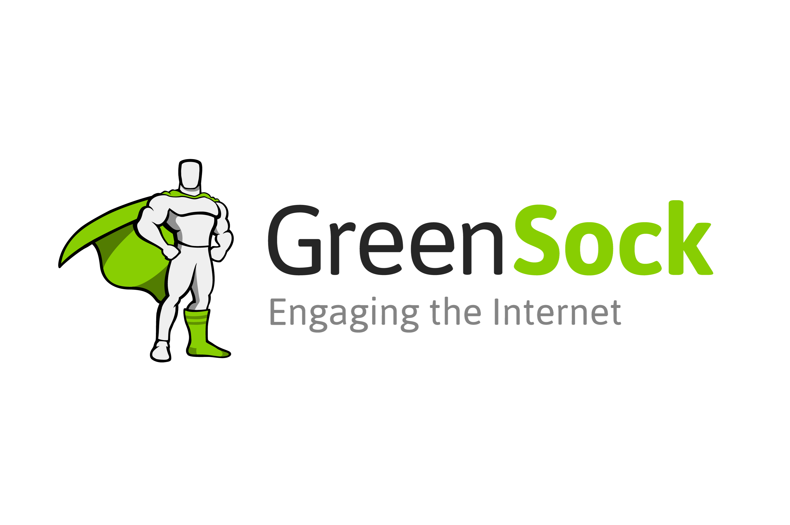

# Welcome to Apple Vision Pro Clone 🍏

<p align="center">Welcome to the Apple Vision Pro Homepage Clone project! This project is an attempt to recreate the homepage of Apple Vision Pro's website, aiming to replicate both the design and functionality using a variety of modern web technologies. Our goal is to provide users with an immersive experience that closely mirrors the original while leveraging the power of HTML, CSS, JavaScript, Canvas, GSAP (GreenSock Animation Platform), and Locomotive Scroll.</p>

<p align="center">
  
</p>


## Deployment
The project is deployed and accessible [here](https://applevisionproweb.netlify.app/).

## Technologies Used
<div align="center">
  
  
  
  
  
</div>

- **HTML**: Structure for the web content.
- **CSS**: Styling for the user interface.
- **JavaScript**: Adds interactivity.
- **Canvas**: Utilized for specific graphical elements.
- **GSAP (GreenSock Animation Platform)**: Smooth animations.
- **Locomotive Scroll**: Smooth scroll experience.

## Installation and Usage

To run this project locally, follow these steps:

1. Clone the repository:

   ```bash
   git clone https://github.com/vishu3053/Apple-Vision-Pro.git

2. Navigate to the project directory:

   ```bash
   cd Apple-Vision-Pro

3. Open the index.html file in your web browser.

4. Explore the Apple Vision Pro clone, interact with the elements, and experience the smooth animations.


<p align="center">
  Made with ❤️ by [Vishwash Patel](https://github.com/vishu3053)
</p>
